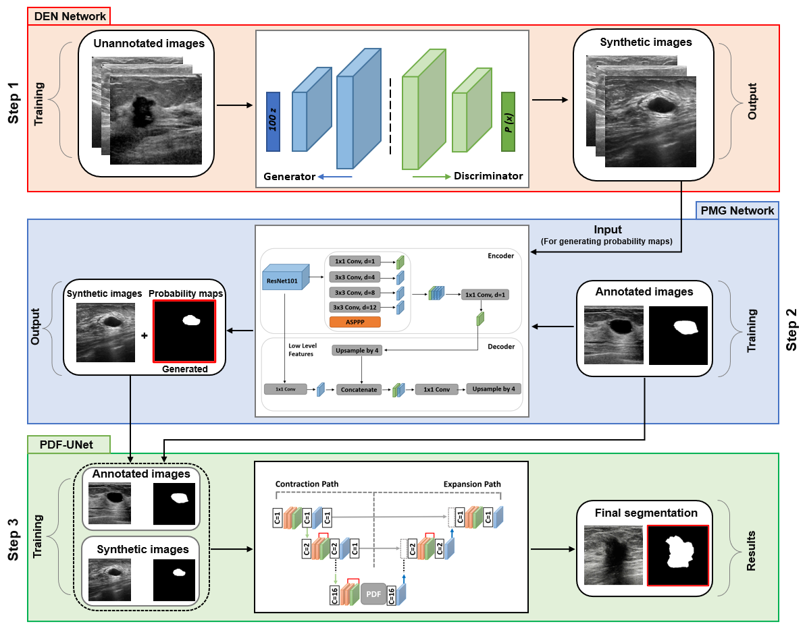
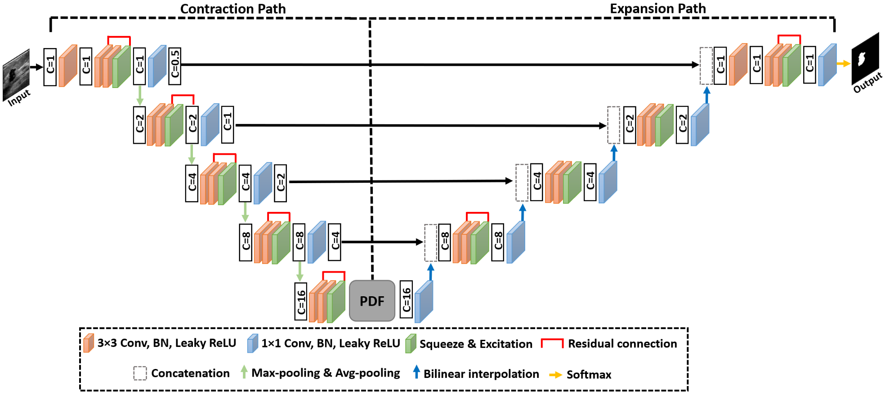
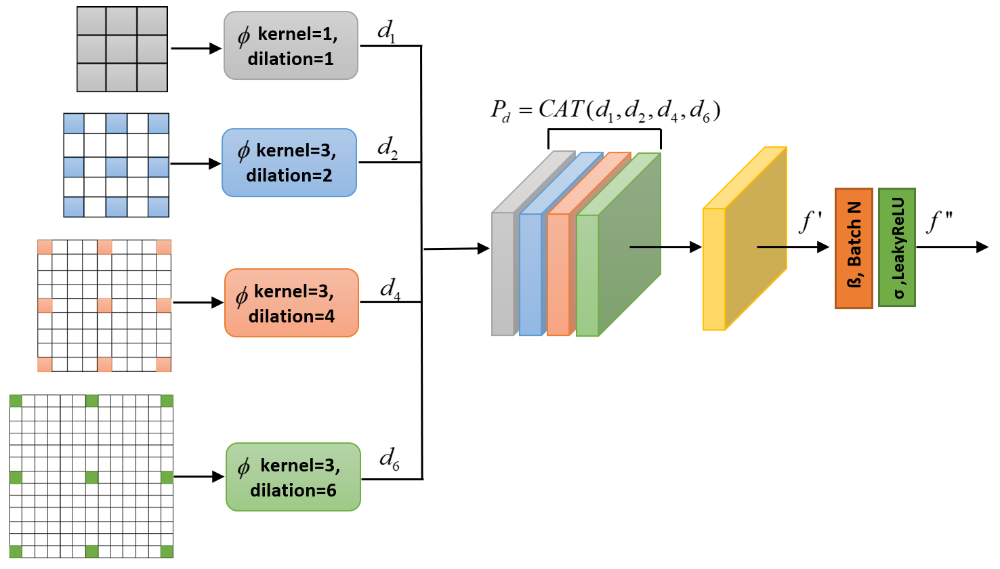

This repository contains the original implementation of "**[PDF-UNet: A semi-supervised method for segmentation of breast tumor images using a U-shaped pyramid-dilated network
](https://doi.org/10.1016/j.eswa.2023.119718)**" in PyTorch. This paper has been published in "*Expert Systems with Applications - Elsevier, IF:8.665*"

## Proposed Architecture


## PDF-UNet


# Pyramid-dilated fusion block


## Visualization of segmentation results


## Requirements

- Python 3.9.7
- PyTorch: 1.10.1
- OpenCV: 4.6.0
- Numpy: 1.22.3
- Matplotlib: 3.5.1

## Cite:

If you use PDF-UNet architecture in your project, please cite the following paper:
```
Iqbal, A., & Sharif, M. (2023). PDF-UNet: A semi-supervised method for segmentation of breast tumor images using a U-shaped pyramid-dilated network. Expert Systems with Applications, 119718. DOI: https://doi.org/10.1016/j.eswa.2023.119718
